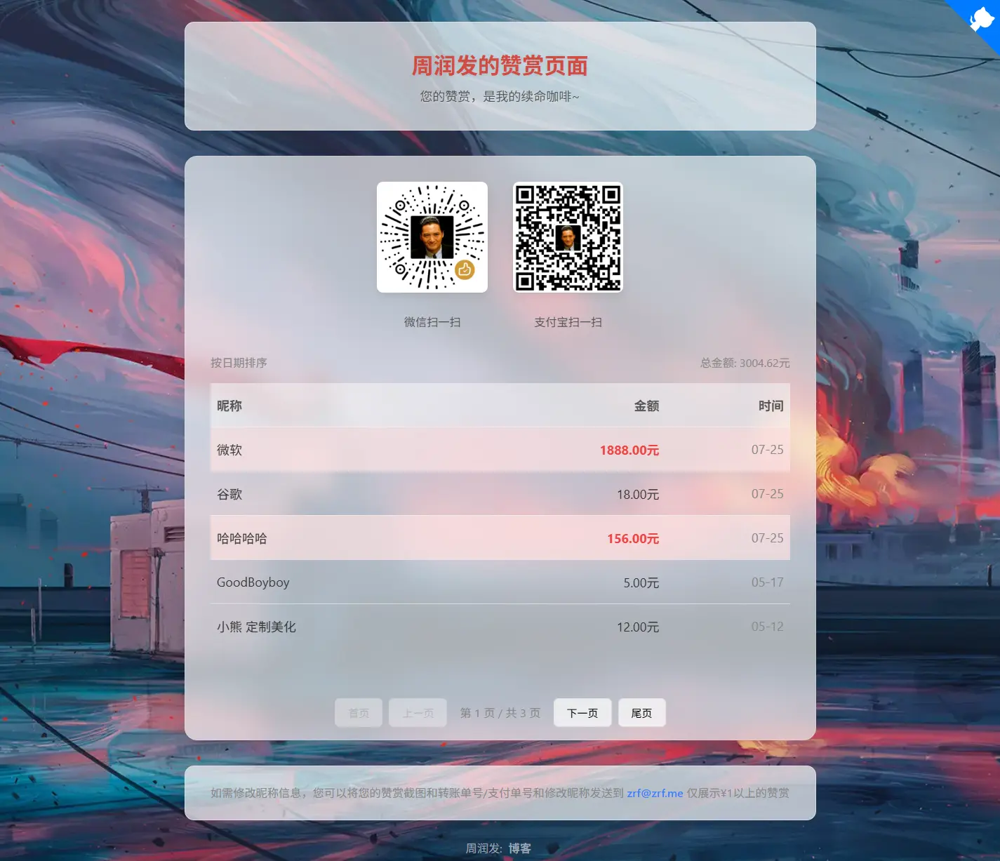

# Rewards - 一个高度可定制的赞赏展示页

这是一个基于 Cloudflare Pages 和 KV 存储构建的、轻量级、高度可定制的赞赏记录展示页面。它允许您轻松地展示收到的赞赏，并通过环境变量进行全方位的个性化配置，无需修改任何代码。

## ✨ 功能特性

- **🚀 Serverless 架构**：完全托管在 Cloudflare 的全球网络上，无需自己的服务器。
- **⚡️ 极速访问**：得益于 Cloudflare Pages 的静态站点优化和 CDN 加速。
- **📦 KV 数据存储**：使用 Cloudflare KV 作为数据库，读写速度快，成本极低。
- **🎨 高度可定制**：从背景图片、标题、二维码到分页数量、高亮金额，几乎所有内容都可以通过环境变量进行配置。
- **📱 响应式设计**：在桌面和移动设备上都有良好的视觉效果。
- **🔒 安全后台**：提供一个独立的 `/admin.html` 页面，通过密码保护来提交新的赞赏记录。
- **🌟 金额高亮**：可以自定义金额阈值，为“大额”赞赏提供特殊颜色高亮。
- **📄 自动分页**：当赞赏记录过多时，自动生成分页导航。
- **💨 平滑加载**：优雅的加载动画和内容淡入效果，提升用户体验。

## 部署指南

**第一步：获取代码**

点击本项目页面右上角的 **Fork** 按钮，或使用 **Use this template**，将此项目复制到您自己的 GitHub 仓库中。

**第二步：创建 KV 命名空间**

1.  登录到您的 Cloudflare 账户。
2.  在左侧菜单中，进入 **Workers 和 Pages** -> **KV**。
3.  点击 **创建命名空间**。
4.  为您的命名空间取一个名字，例如 `REWARDS_KV`，然后点击创建。

**第三步：在 Cloudflare Pages 中创建项目**

1.  在 Cloudflare 仪表板中，进入 **Workers 和 Pages** -> **Pages** 选项卡。
2.  点击 **创建项目** -> **连接到 Git**。
3.  选择您刚刚创建的 GitHub 仓库。
4.  在“**设置构建和部署**”页面，填写以下信息：
    *   **构建命令 (Build command)**:  (**留空**，不需要任何命令)
    *   **构建输出目录 (Build output directory)**:  `public`
    *   点击“**保存并部署**”。

**第四步：绑定 KV 和设置环境变量**

1.  等待第一次部署完成后，进入您刚刚创建的 Pages 项目的控制台。
2.  点击 **设置** -> **函数** -> **KV 命名空间绑定**。
3.  点击 **添加绑定**：
    *   **变量名称**：`REWARDS_KV`
    *   **KV 命名空间**：选择您在第二步中创建的 `REWARDS_KV`。
    *   点击 **保存**。

4.  现在，进入 **设置** -> **环境变量**，在这里配置您的个性化信息。这是最关键的一步！

    *   点击 **添加变量**，然后根据下面的“配置说明”添加您需要的变量。**必须设置 `FORM_SECRET` 以及您自己的收款码链接！**

5.  完成变量设置后，回到项目的**部署**页面，点击**重新部署**最新的版本。

**恭喜！** 您的专属赞赏页面现在已经部署完成了。

## ⚙️ 配置说明 (环境变量)

您可以通过在 Cloudflare Pages 项目的 **设置 -> 环境变量** 中添加以下变量来自定义您的页面。**必须**至少配置前三项。

| 变量名称                        | 说明                                                              | 默认值                          |
| ------------------------------- | ----------------------------------------------------------------- | ------------------------------- |
| `FORM_SECRET`                   | **（必须）** 访问 `/admin.html` 页面提交记录时所需的密码。      | *无*                            |
| `CONFIG_QR_WECHAT`              | **（必须）** 您的微信收款二维码图片链接。                          | `您的二维码链接`                  |
| `CONFIG_QR_ALIPAY`              | **（必须）** 您的支付宝收款二维码图片链接。                        | `您的二维码链接`                  |
| `CONFIG_PAGE_TITLE`             | 浏览器标签页上显示的标题。                                        | `周润发的赞赏页面`              |
| `CONFIG_BANNER_TITLE`           | 页面顶部大标题下的副标题。                                        | `您的赞赏，是我的续命咖啡~`       |
| `CONFIG_BACKGROUND_IMAGE_URL`   | 整个页面的背景图片链接。                                          | `/img/bj.webp` (项目内图片)       |
| `CONFIG_FAVICON`                | 浏览器标签页上显示的图标链接。                                    | `/img/icon.webp` (项目内图片)     |
| `CONFIG_INFO_TEXT`              | 页面底部信息框中的提示文字。                                      | `如需修改昵称信息...`           |
| `CONFIG_INFO_EMAIL`             | 页面底部信息框中显示的联系邮箱。                                  | `zrf@zrf.me`        |
| `CONFIG_FOOTER_HTML`            | 最底部的版权信息，支持 HTML。                                     | `周润发: <a href="https://d.zrf.me/blog">博客</a>` |
| `CONFIG_ROWS_PER_PAGE`          | 每页显示的赞赏记录数，默认为10量。                                          | `10`                            |
| `CONFIG_HIGHLIGHT_PRIMARY`      | 主要高亮（红色）的金额门槛。                                      | `100`                           |
| `CONFIG_HIGHLIGHT_SECONDARY`    | 次要高亮（黄色）的金额门槛。                                      | `20`                            |

### **✍️ 如何使用**

部署完成后，您可以通过以下链接访问您的赞赏页：

-   **主页**: `https://你的项目地址`
    *   *说明：这是公开的赞赏展示页面，所有人都可以访问查看。*

-   **后台**: `https://你的项目地址/admin.html`
    *   *说明：这是用于手动添加赞赏记录的后台页面，需要输入密码才能提交。*

-   **JSON数据**: `https://你的项目地址/api/rewards`
    *   *说明：这是一个公开的 API 链接，它会以 JSON 格式返回所有赞赏数据。您可以将此链接用于其他项目或进行二次开发。*

### **后台提交说明**

访问 `https://你的项目地址/admin.html` 提交页面后，您需要填写以下信息：

-   **赞赏者名字**: (必需) 填写赞赏者的昵称。
-   **金额**: (必需) 填写收到的具体金额。
-   **提交时间 (可选)**: 如果留空，系统会自动记录为当前时间。您也可以点击选择一个过去的时间点进行补录。
-   **提交密码**: (必需) 输入您在 Cloudflare 环境变量 `FORM_SECRET` 中设置的密码。

填写完毕后，点击“提交”按钮即可。

## 📄 许可证

本项目基于 [MIT License](LICENSE) 开源。